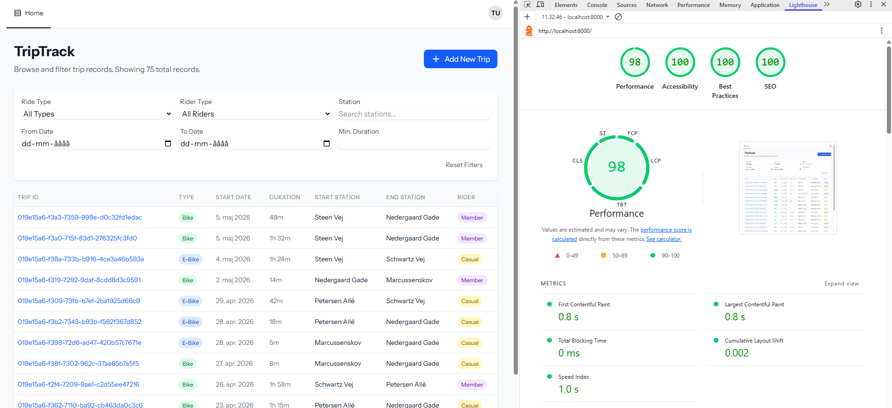
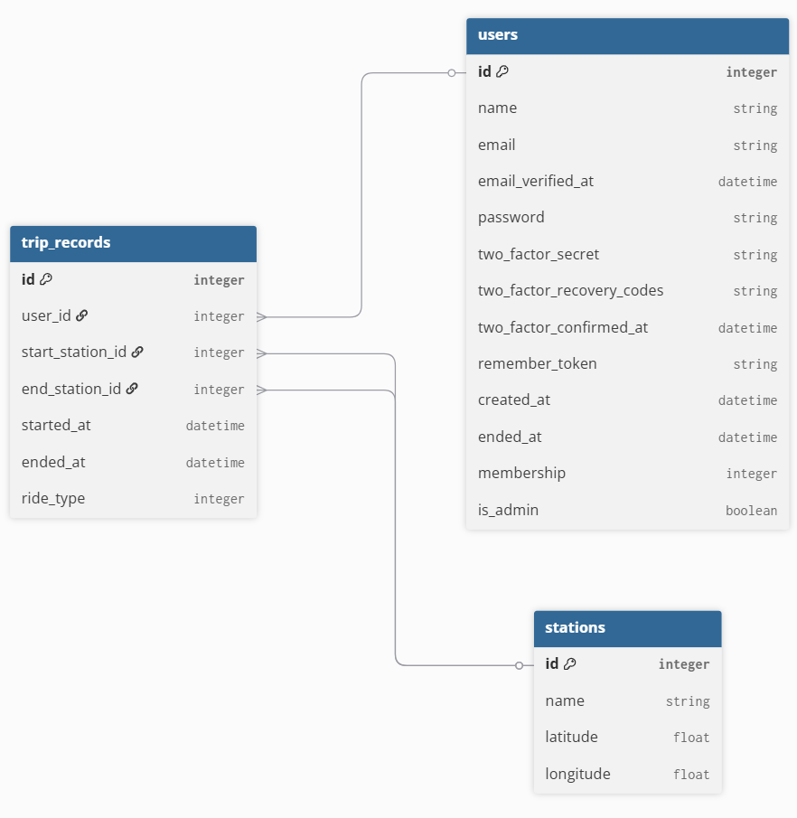
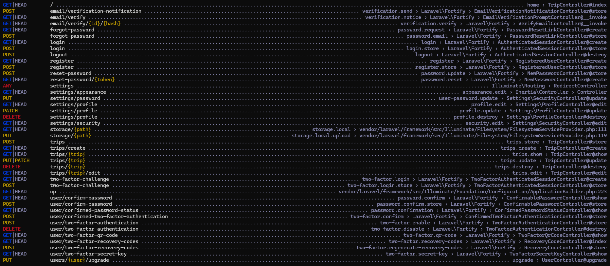

# TripTrack

TripTrack is an application that, in short, allows you to share your trips publicly.
A trip consists of a start and end station as well as a start and end time.
Additionally, you may also register your ride as using either a classic bike or an electric bike.

Upon registration, you will be considered a "casual rider". As a rider, you can add, edit and delete your trips.

## Features

- **Single Page Application (SPA)** - Fast interactive feedback, no full page reloads.
- **Table Lazy-Loading** - Scroll down the list of trips infinitely.
- **Trip Filtering** - Filter the table to find exactly what you're looking for.
- **Secure Data Handling** - You may only modify your own records.
- **Compressed Document** - Serves the document with gzip encoding for faster load time.
- **Responsive Design** - The UI works on all screen sizes.
- **Request Logging** - Requests are logged with the URI, method and response time.
- **Easy-to-use Trip Creation** - Create trips with an intuitive map design.

## Requirements

Although the versions are not strictly requirements, the following software is required to build this project. The versions listed were used during development and are therefore tested.

I recommend using NVM (Node Version Manager) for Node & NPM management.

The project was built on Laravel 13, so PHP 8.3+ is a requirement.

Furthermore, some required PHP extensions are not necessarily included by default, such as the XML extension, mbstring extension, and sqlite3 extension. Make sure to install these and any others if you encounter errors in the build process.

<table>
    <tr>
        <th>Laravel</th>
        <td>13</td>
    </tr>
    <tr>
        <th>PHP</th>
        <td>8.3.6</td>
    </tr>
    <tr>
        <th>Composer</th>
        <td>2.9.7</td>
    </tr>
    <tr>
        <th>Node</th>
        <td>v24.15.0</td>
    </tr>
    <tr>
        <th>NPM</th>
        <td>11.12.1</td>
    </tr>
</table>

## Installation

Upon cloning this repository:
1. Run `composer install`
2. Run `npm install`
3. Copy the `.env.example` file to `.env`
4. Run `php artisan key:generate`
5. Run `php artisan migrate`

To run the software, use:
- Debug: `composer dev`
- Production:
  - `npm run build`
  - `php artisan serve`

The app will be available at http://localhost:8000.

## Quick Start

A database seeder is included to create test users and data. After installation, you may seed the database using `php artisan db:seed`.

This will create a test user with the following credentials:

<table>
    <tr>
        <th>Email</th>
        <th>Password</th>
    </tr>
    <tr>
        <td>test@example.com</td>
        <td>password</td>
    </tr>
</table>

## How to use

When accessing the root of the site, you will be presented with a table of trips.
You may click the ID of any of these trips to show a detailed view of that particular trip. Additionally, you may sign in to add new trips of your own by pressing the "Add New Trip" button above the trip table. Here, you will be able to place two markers on the map - one for the start and one for the end. Additionally, a start and end time as well as the vehicle used are required.

In case you want to edit or delete one of your trips, you may go to the detailed view and do so using the buttons at the top right. This will only be available to you if you are signed in as the rider of the trip.

## Testing

The project has unit and feature tests. You may run the tests using the following command:

```bash
php artisan test
```

To run with a test coverage report, the PCOV extension for PHP is required. Once installed, you may run the following:

```bash
php artisan test --coverage
```

## Logging

In case of errors during runtime, these will be logged to the `storage/logs/laravel.log` file.

## Service Level Agreement (SLA)

The SLA declaration can be found in the <a href="SLA.md">SLA.md</a> file.

## Lighthouse



## Architecture

The project uses PHP as the backend and blade + Vue as the frontend through Inertia. This setup makes it a single-page application (SPA) out-of-the-box.

Routes are defined in <a href="routes/web.php">routes/web.php</a>. These routes link to <a href="app/Http/Controllers/">controllers</a>, which then use Inertia to render a Vue page and pass along any necessary data from the server such as entries from the database.

On top of controllers, <a href="app/Http/Middleware/">middleware</a> and <a href="app/Http/Requests/">form validation</a> also exist to handle cases before the controllers even know of them. There are also <a href="app/Http/Resources/">resources</a> to define the object structure sent from the server to the client for different models.

### Database



### Routes


